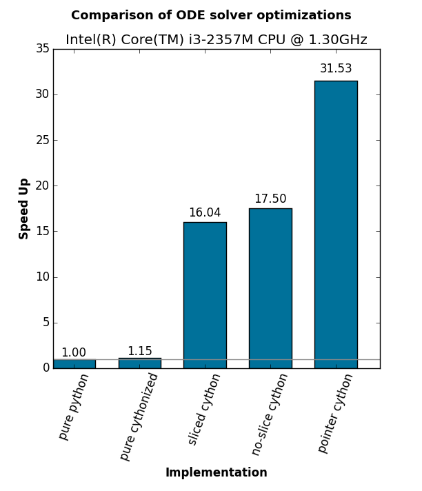

How to speed up Cython: a comparison study of ODE solver optimizations
======================================================================

The main goals of this shootout were

#. learn how to use Cython
#. figure out how to optimize a Cython implementation given a well known task

The task was implementing numerical solvers for ordinary differential equations
(ODEs), namely the forward-Euler, 2nd order Runge-Kutta, and finally the 4th
order Runge-Kutta method. Results should be stored in :code:`numpy.ndarray`
objects, as the implementations may be integrated into an existing toolkit to
simulate large-scale neural networks that already makes heavy use of
:code:`numpy`.

1D case study
-------------
The shootout does not contain an optimized variant for 1D. If the system that
you wish to integrate is only 1D, simply browse the web and take one of the
existing Cython solutions. Or quickly port the pure python version to proper
Cython. This means to add :code:`cdef` everywhere where it is possible. The
speedup is well beyond 50x the original pure python speed.

nD case study
-------------
Things get more interesting as soon as you have to solve an n-dimensional
system. Directly using :code:`numpy.arrays` in Cython yields only mediocre
speedups, if any at all. Hence this shootout.

Pure Python Implementation
~~~~~~~~~~~~~~~~~~~~~~~~~~
* pure python
* numpy ndarray

Cythonized Python Implementation
~~~~~~~~~~~~~~~~~~~~~~~~~~~~~~~~
* symlink to the pure python method
* how good is Cython in translating pure python code that uses numpy

Sliced Cython Implementation
~~~~~~~~~~~~~~~~~~~~~~~~~~~~
* get rid of python objects as far as possible
* store result in one huge matrix, pass around slices into that matrix
* move the problem into a class to avoid creation of temporaries

No-Slice Cython Implementation
~~~~~~~~~~~~~~~~~~~~~~~~~~~~~~
* how much speedup by reducing slice-usage where possible

Pointered Cython Implementation
~~~~~~~~~~~~~~~~~~~~~~~~~~~~~~~
* can we gain speedup by using pointers all the time it is actually possible?

Results
~~~~~~~

.. code::

        $ ./shootout.py
        building cython modules if necessary
        running build_ext
        running method 'pure python'
        running method 'pure cythonized'
        running method 'sliced cython'
        running method 'no-slice cython'
        running method 'pointer cython'
        platform:  Intel(R) Core(TM) i3-2357M CPU @ 1.30GHz
        method			runtime	speedup
        ----------------------------------------
        pure python		4.6412	1.0000
        pure cythonized		4.0361	1.1499
        sliced cython		0.2894	16.0394
        no-slice cython		0.2652	17.5029
        pointer cython		0.1472	31.5325

Conclusions
-----------
* always measure all the changes that you introduce!
* if possible, write the code that you need to speed up in C, C++, or Fortran
  right from the beginning and call it using Cython
* optimized Cython looks almost like C anyway...

TODO
----
* Improve README
* Comparisons
  * Python-side implementation/derivation of :code:`Problem`. Example in :code:`

